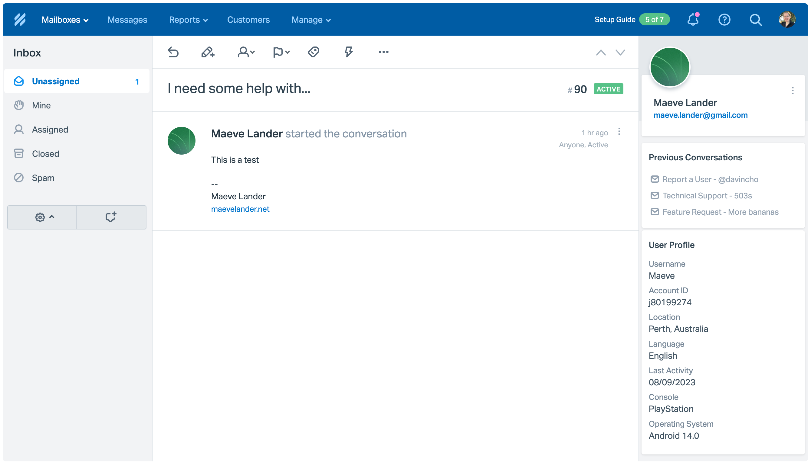

Helpscout <> Mailchimp Integration
==============================================

This is a custom app to display Mailchimp customer profile fields directly in the Help Scout Sidebar. It can be run as well as or instead of the [official Mailchimp integration](https://docs.helpscout.com/article/272-mailchimp) which displays which mailing lists the customer is subscribed to.

Install and Configure
-------------------------

1. Download the [zip file](https://github.com/maevelander/helpscout-mailchimp/archive/main.zip) and unzip.
1. Define your Help Scout secret key and [Mailchimp API key](https://admin.mailchimp.com/account/api/) in `helpscout-mailchimp.php`.
1. Edit `helpscout-mailchimp.php` to define your Mailchimp Audience ID. You can find this in your Mailchimp account > Audience > All Contacts > Settings > Audience name and defaults
1. Edit `helpscout-mailchimp.php` to define the audience fields you want to display in Help Scout. Find these in your Mailchimp account > Audience > All Contacts > Settings > Audience fields and merge tags.
1. Save and upload the `helpscout-mailchimp` folder to your webspace

Create your Help Scout app
-------------------------

1. Go to the LEGACY [HelpScout custom app interface](https://secure.helpscout.net/apps/custom/).
1. Give it an App Name and set the Content Type to Dynamic Content.
1. Set the Callback URL as the filepath to `helpscout-mailchimp.php`
1. Enter the secret key you used in `helpscout-mailchimp.php` above.
1. Check the mailboxes you want the app to show up in
1. Save. You can now test your app.
